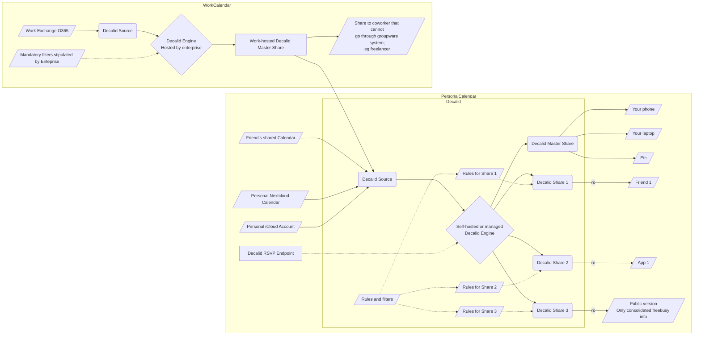

# Decalid

A decentralized calendar interaction and distribution project.

## Preamble

Calendars are broken on the Internet. If we have M calendars (work, home, chores, ...) and N people we want to share those calendars with, we usually end up sharing none and instead talking out-of-band due to how hard it is to share calendars while retaining privacy.

Web calendars have no notion of fine-grained permissions or minimization of information provided while being useful to all people the calendars are shared with.

This proposal wants to make a M-1-N system where you aggregate all source "authoritative" calendars to create a "user master calendar" view that can then be shared using filters.

The filtering can ensure that no exfiltration of confidential information described in the calendar is ever compromised, while providing a convenient way for users and apps to share information to your calendar. For example, apps like Calendly should not need to access your whole calendar details even if they need to be able to read-write back into the calendar with their own events. Instead, they should just be seeing free/busy status, and not event details. This is currently not possible.

This project explores the viability of such an approach.

## Project flow chart

